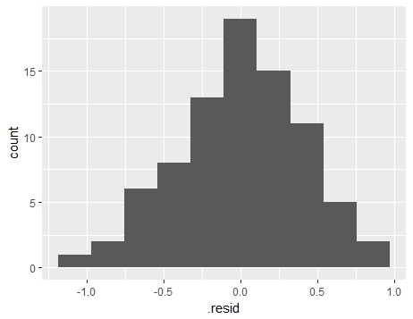
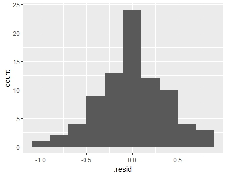

## The Association Between Fatalism, Depression and Simplicity of Thoughts

Since depression is related with thoughts of suicide and high levels of stress that might affect health, this study was done in order to  find out whether fatalism possibility among depressed individuals is related with how they view the world . Thinking patterns that can be signified as one of the characteristics of depression  might influence the way depressed individuals interpret everyday stress. Participants were 82 psychiatric patients hospitalized for depression. It was found that simplicity of thought ( viewing world as black or white)  and fatalism have a positive relationship and  it significantly predicts fatalism. However, depression is  found as a better predictor of fatalism than simplicity. And  together these two variables explains more variance in fatalism than when they used single. On the other hand,  we found that the interaction between depression and simplicity is also a significant predictor for fatalism.
```{r setup, include=FALSE}
library(tidyverse)
require(knitr)
library(knitr)
library(broom)
require(stargazer)
require(lm.beta)
library(lm.beta)
require(car)
library(car)
View(Ginzberg)
is.numeric(Ginzberg$simplicity)
is.numeric(Ginzberg$depression)
is.numeric(Ginzberg$fatalism)
shapiro.test(Ginzberg$simplicity)
boxplot(Ginzberg$simplicity)
Ginzberg$simplicity<-log(Ginzberg$simplicity)
shapiro.test(Ginzberg$simplicity)
cor.test(Ginzberg$fatalism, Ginzberg$simplicity)
dep_lm<-lm(fatalism ~ simplicity, data = Ginzberg)
summary(dep_lm)
lm1 <- lm(fatalism ~simplicity + depression, data = Ginzberg)
summary(lm1)
dep_lm_std <- lm.beta(dep_lm)
lm1_std <- lm.beta(lm1)
knitr::opts_chunk$set(echo = TRUE)
```
Variables: 
Simplicity (IV) ( numeric )
Measures subject's need to see the world in black and white.
Fatalism (DV) (numeric)
Measured with Fatalism scale.
Depression(IV)(numeric)
Measured with Beck self-report depression scale.


```{r cars}
summary(Ginzberg)
```

After preliminary analyses  and necessary visualisations were performed on the dataset,outliers were detected for simplicity variable by boxplot and a non-normal dist. with Shapiro Wilk normality test; W=0.91, p=1.854e-05. As a result, variable simplicity was transformed into log values and checked with boxplot and histogram in order to see if there is any outliers left and if the normal distribution  acquired after the transformation ( See Figure1 and Figure2). The Shapiro Wilk normality test confirmed the normal distribuion with transformed values; W=0.99,p=0.94. Also the descriptive data results after transformation can be seen below.


```{r pressure, echo=FALSE}
hist(Ginzberg$simplicity)
```

Figure 1. Distrubition of transformed  Simplicity Data

```{r boxplot, echo=FALSE}
boxplot(Ginzberg$simplicity)
```

Figure2. Boxplot for Outlier Control of Transformed Simplicity Data

Hypothesis 1:Simplicity and fatalism might show a positive relationship.

  A pearson corelation analysis was computed to assess the relationship between Fatalism and Simplicity. According to results, there was a positive correlation between the two variables, r(82)=0.50,p<.05. A scatterplot summarizes the results (Figure 3) below. Overall, there was a moderate positive correlation between fatalism and simplicity. Increases in simplicity levels were correlated with increases in rating of fatalism.
```{r correlation, echo=FALSE}
ggplot(data=Ginzberg)+aes(x=simplicity,y=fatalism)+geom_point()
```

Figure 3. The relationship between simplicity and fatalism.
              
Hypothesis 2: Fatalism can be predicted from simplicity levels.

 A linear regression was carried out to investigate the relationship between fatalism and  simplicity of thoughts ( from now on will be referred as Model1). There was a significant relationship between fatalism and simplicity (p < 0.001).For simplicity, there was a 0.73  increase in fatalism  for each extra level of simplicity. The adjusted R 2 value was 0.23, so 23% of the variation in fatalism  can be explained by the model containing simplicity of thoughts( R(1,80)=1.58,p<.001,R²=.23).
 
The residuals are approximately normally distributed so the assumption of normality has been met( See Figure 4), Shapiro-Wilk normality test results are as follows; W = 0.99061, p>.05.

```{r residuals, echo=FALSE}


```
     
Figure 4. Residual distributions for normality test of model 1.

Multiple linear regression was carried out to investigate the relationship between simplicity of thought, depression and fatalism. The model significantly explained 46% of the variance; R(2,79)=.55, p<.001,R²=.46. There was a significant relationship between simplicity and fatalism(p < 0.05), depression and fatalism (p <0.001). For simplicity, there was a 0.12 increase in fatalismnlevels  for each extra score of simplicity. For each extra point of depression, the fatalism rate increases by 0.44 points. The adjusted R² value was 0.35, so 35% of the variation in fatalism can be explained by the model containing depression and simplicity as predictors.The data met assumptions of homogenity of variance and multicollinearity and the residuals were normally distributed, Shapiro Wilks results; W=.99, p=.78.( See figure 5).
      
Predictors	(VIF scores)
Simplicity	1.72
Depression	1.73


```{r residuals1, echo=FALSE}


```

Figure 5. Residual distributions for normality test of model 2.

So, since the second model has a higher prediction rate for fatalism, do we really need to use it? In order to see if model 1 and 2 differs significantly and Analysis of variance was performed; F(1)=20.1,p<.001. The two model was found to significantly differ from each other. Which means, it is rationable to use prefer second model while it significantly differs from the first model and explains the variance in outcome variable better ( See below )

```{r table, echo=FALSE}

results_table_html <-
  stargazer(dep_lm_std,
            lm1_std,
            coef = list(dep_lm_std$standardized.coefficients,
                        lm1_std$standardized.coefficients),
            title = "Model comparison",
            dep.var.labels = "fatalism",
            align = TRUE,
            ci = TRUE,
            df = TRUE,
            digits = 2,
            type = "text")
```


Source
Personal communication from Georges Monette, Department of Mathematics and Statistics, York University, with the permission of the original investigator.


References
Fox, J. (2008) Applied Regression Analysis and Generalized Linear Models, Second Edition. Sage.
